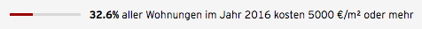

# Balance Gauge

Renders an info gauge that's useful for visualizing balances between two dimesions

## Parameters

| Param | Type                  | Description                                                                     |
| ---   | ---                   | ---                                                                             |
| class | `String`              | A className for the component                                                   |
| ratio | <code>Number</code>   | Number between 0 and 1                                                          |
| text  | <code>function</code> | Function that gets passed the current ratio and should return descriptive text. |

## Example

**Code**

```jsx
const text = ratio => {
  const percentage = Math.round(ratio * 100 * 100) / 100
  return <span>
    <strong>{percentage}%</strong> aller Wohnungen im Jahr 2016 kosten 5000 €/m² oder mehr
  </span>
}

<BalanceGauge class='classname' ratio='0.326' text={text} />
```

**Screenshot**


