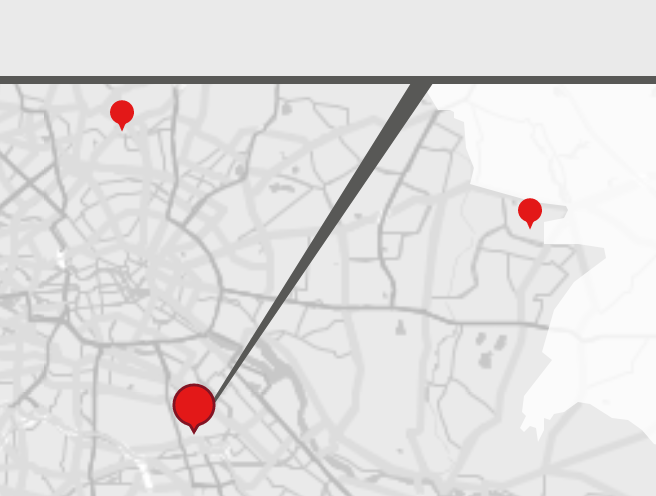

# MapPolygonWithAbsolutePoints

Renders a Line from an absolute position of the screen to a geo position on a map

## Parameters

| Param | Type | Description |
| --- | --- | --- |
| pointCalculationFunctions | `[function]` | An array of functions that take the parameters `{ width, height }` and must return an object with numbers for `{ x, y }` |
| … |  | anything you can pass to [`Path`](http://leafletjs.com/reference-1.3.0.html#path) can also be passed to this polygon |

### context

This component uses the [`map` context of react leaflet](https://react-leaflet.js.org/docs/en/intro.html#component-context)
and therefore needs to be a child or some grandchild of [`<Map>`](https://react-leaflet.js.org/docs/en/components.html#map)

## Example

**Code**

```jsx
const polygonProps = {
  positionsOnMap: [{
    lat: feature.geometry.coordinates[1],
    lng: feature.geometry.coordinates[0]
  }],
  pointCalculationFunctions: [
    ({ width, height }) => ({ x: width * 0.8, y: height }),
    ({ width, height }) => ({ x: width * 0.8 + 10, y: height })
  ],
  fillOpacity: 1,
  fillColor: '#000',
  color: '#000',
  weight: 1
}

<MapPolygonWithAbsolutePoints {...polygonProps} />
```

**Screenshot**


