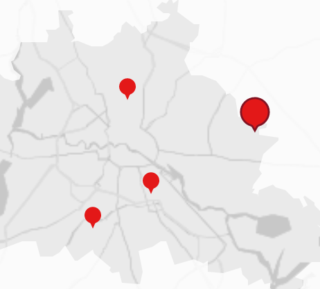

# MapSelectableMarker

Renders a marker at a given location.
## Dependencies

### npm

```
npm i react-leaflet-div-icon
```

### context

This component needs to be a child or some grandchild of [`<Map>`](https://react-leaflet.js.org/docs/en/components.html#map)

## Parameters

| Param            | Type     | Description                                            | Default   |
| ---              | ---      | ---                                                    | ---       |
| isSelected       | `Bool`   | changes the size and style of the marker               | false     |
| fillColor        | `Bool`   | changes the size and style of the marker               | red       |
| strokeColor      | `Color`  | outline color                                          | bordeaux  |
| hasStroke        | `Bool`   | wheater to draw outlines in deselected state           | false     |
| optimizeForTouch | `Bool`   | draws a bigger invisible touch area around the marker  | undefined |
| position         | `LatLng` | see: https://leafletjs.com/reference-1.3.4.html#latlng | undefined |
| …                | `…`      | Everything you can pass to [`Marker`](https://leafletjs.com/reference-1.3.4.html#marker) except `icon`. | |

## Example

**Code**

```jsx
<MapSelectableMarker position={L.LatLng(52.69,13.06)} isSelected={false} optimizeForTouch={isTouchEnabled} />
```

**Screenshot**


