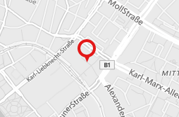

# MapLocator

Renders a marker at a given location.
## Dependencies

### context

This component needs to be a child or some grandchild of [`<Map>`](https://react-leaflet.js.org/docs/en/components.html#map)

## Parameters

| Param    | Type     | Description                                            | Default      |
| ---      | ---      | ---                                                    | ---          |
| position | `LatLng` | see: https://leafletjs.com/reference-1.3.4.html#latlng | undefined    |
| pane     | `String` | The name of the pane the marker should be rendered on. | 'markerPane' |


## Example

**Code**

```jsx
const position = L.LatLng(52.69,13.06 )

<MapLocationMarker position={position} />
```

**Screenshot**


